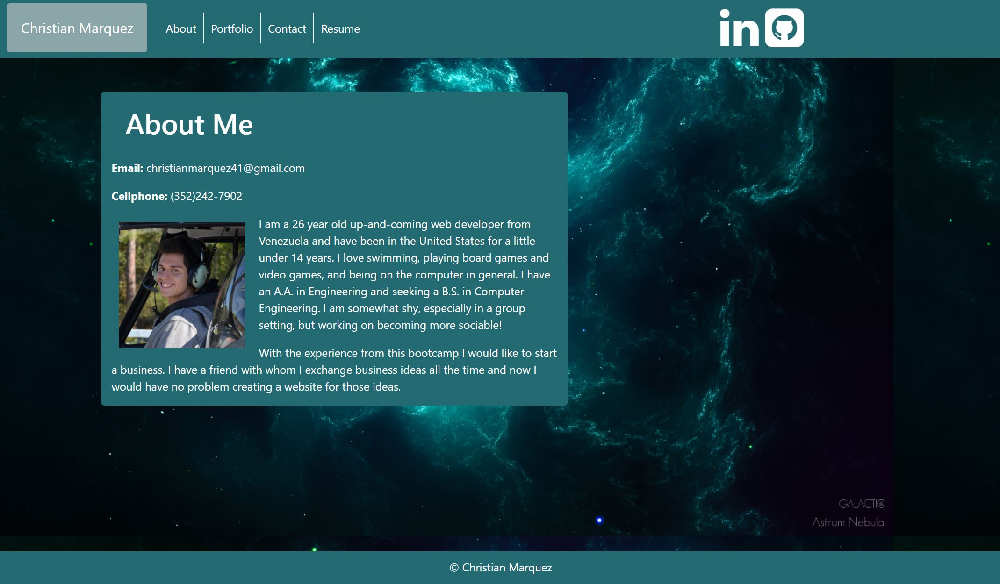
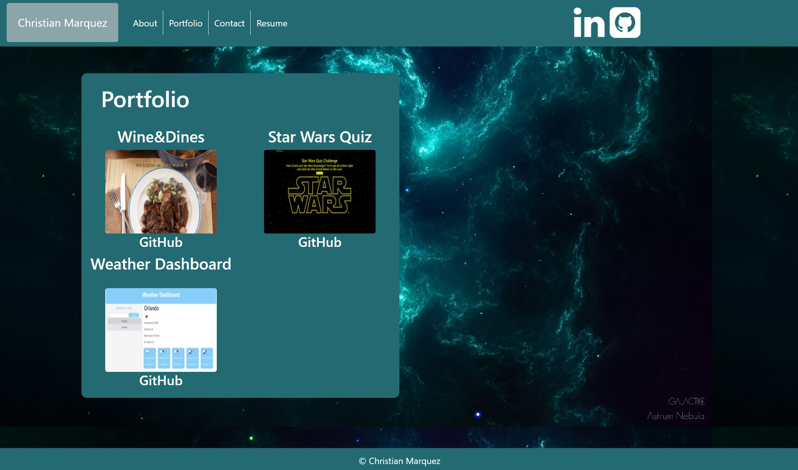

# ResponsivePortfolio
https://tiroxxx.github.io/ResponsivePortfolio/

## Technologies
Built with bootstrap

## Summary
This project includes three webpages. The main page has a short bio of myself which includes a picture. There is also a **contact me** page with a form to send me an email. The implementation of sending an email does not currently work. Lastly, there is a page with my personal portfolio. Because I don't have any projects yet, this webpage has placeholder images where my projects would go. All three pages should dynamically change size depending on the device it is being viewed in.

## License

Licensed under the [MIT License](LICENSE)

## Contact

email: christianmarquez41@gmail.com